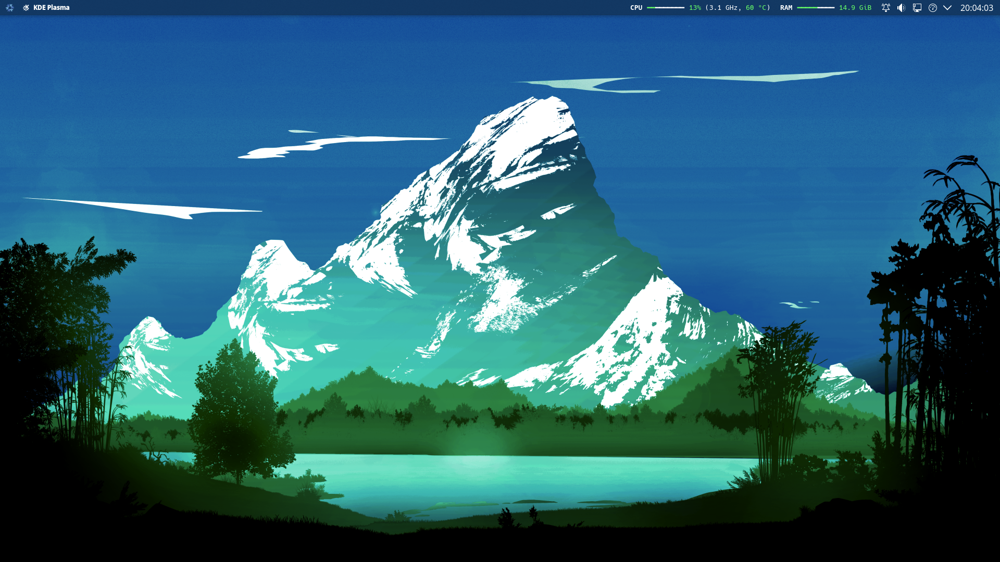
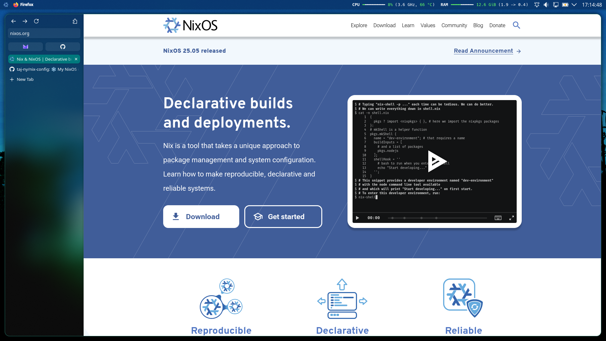
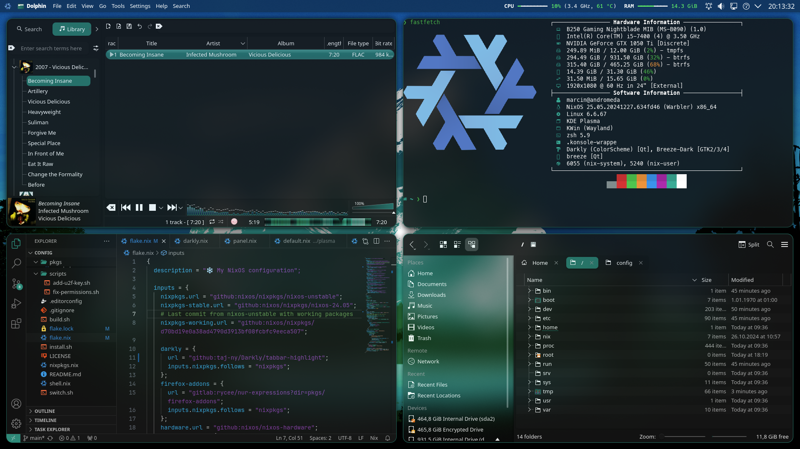

# ❄️ nix-config 

Based on [Misterio77's nix-starter-configs](https://github.com/Misterio77/nix-starter-configs).

### [Plasma](https://github.com/taj-ny/nix-config/tree/main/home/config/_shared/programs/plasma)
- [anametologin/krohnkite](https://github.com/anametologin/krohnkite) - Tiling
- [Bali10050/Darkly](https://github.com/Bali10050/Darkly) - Qt application style
- [dhruv8sh/plasma6-window-title-applet](https://github.com/dhruv8sh/plasma6-window-title-applet) - Window title on the panel
- [luisbocanegra/plasma-panel-colorizer](https://github.com/luisbocanegra/plasma-panel-colorizer) - Panel background opacity, vertical margin adjustments for some widgets (v0.5.2 is used because I'm too lazy to update)
- [manjaro/artwork/themes/breath](https://gitlab.manjaro.org/artwork/themes/breath) - Wallpaper (colors were adjusted, see [pkgs/wallpaper.nix](pkgs/wallpaper.nix))
- [matinlotfali/KDE-Rounded-Corners](https://github.com/matinlotfali/KDE-Rounded-Corners) - Rounded corners, window border, shadows
- [peterfajdiga/kwin4_effect_geometry_change](https://github.com/peterfajdiga/kwin4_effect_geometry_change) - Window animations
- [taj-ny/kwin-better-blur](https://github.com/taj-ny/kwin-effects-forceblur) - Force blur, rounded corners, static blur for lower power usage on my laptop, variable blur strength
- [Zren/plasma-applet-commandoutput](https://github.com/Zren/plasma-applet-commandoutput) - System information on the panel ([script](pkgs/panel-system-info/main.py))

### Other programs
- [Clementine](https://github.com/clementine-player/Clementine) - Music player
- Firefox - Web browser, [mbnuqw/sidebery](https://github.com/mbnuqw/sidebery) for vertical tabs, custom CSS is at [home/config/_shared/programs/firefox](home/config/_shared/programs/firefox)